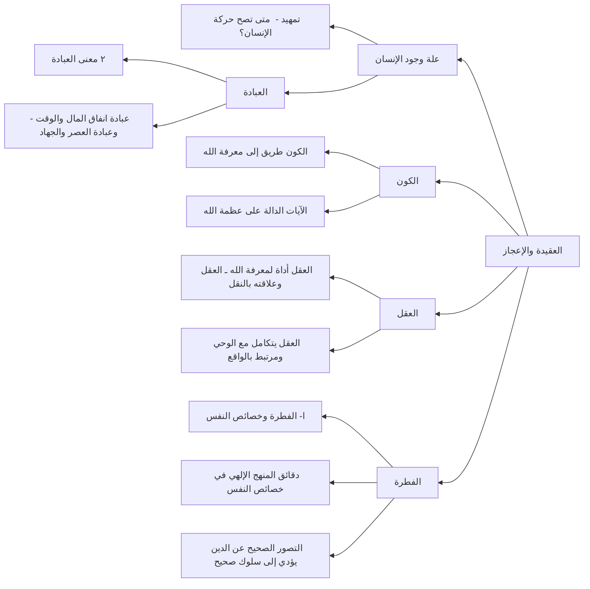

# {{page.description}}

#### [المصدر الاصلي ](https://www.nabulsi.com/category/Creed-Miraculousness620#)

---

### ابرز الكلمات





```mermaid
graph RL;

B[العقيدة والإعجاز] --> C1[علة وجود الإنسان]

    C1 --> D[تمهيد -  متى تصح حركة الإنسان؟]
    C1 --> C2[العبادة]
    C2 --> E[ ٢ معنى العبادة]
    C2 --> F[ عبادة انفاق المال والوقت - وعبادة العصر والجهاد]

    B --> H1[الكون]
    H1 --> H[ الكون طريق إلى معرفة الله]
    H1 --> I[ الآيات الدالة على عظمة الله]
      B --> J1[العقل]
    J1 --> J[ العقل أداة لمعرفة الله ـ العقل وعلاقته بالنقل]
    J1 --> K[ العقل يتكامل مع الوحي ومرتبط بالواقع]
       B --> L1[الفطرة]
    L1 --> L[ا- الفطرة وخصائص النفس]
    L1 --> M[ دقائق المنهج الإلهي في خصائص النفس]
    L1 --> N[ التصور الصحيح عن الدين يؤدي إلى سلوك صحيح]
```
